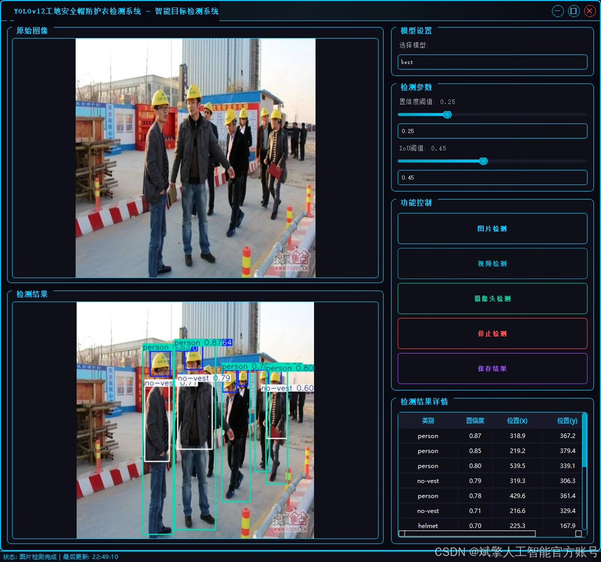
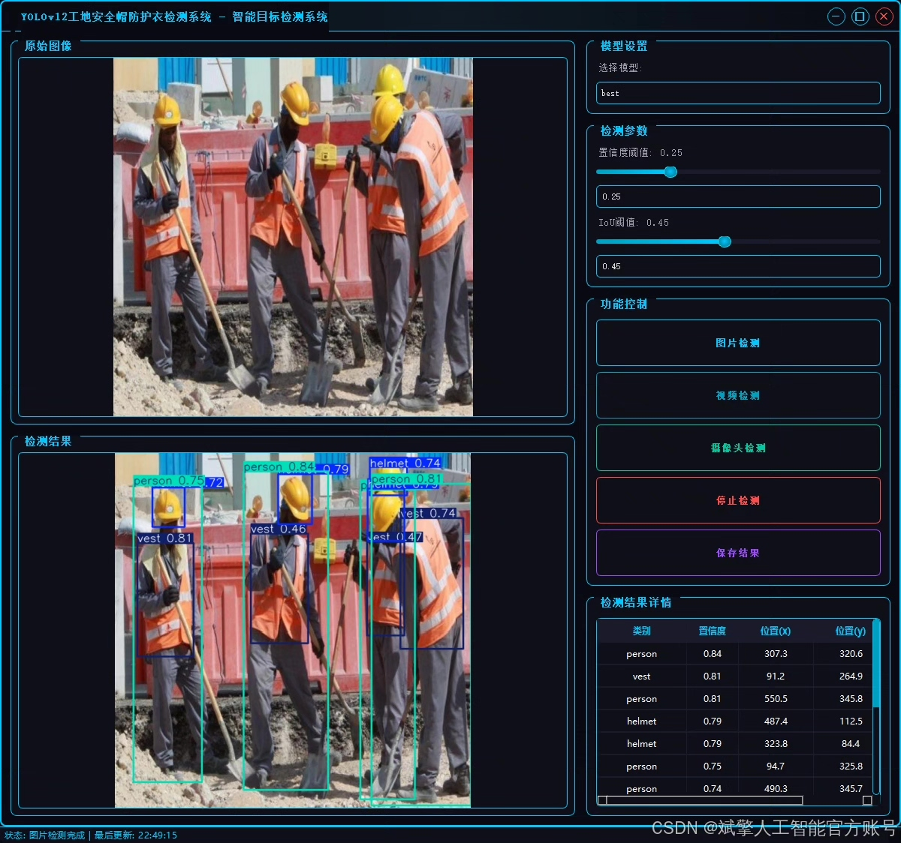
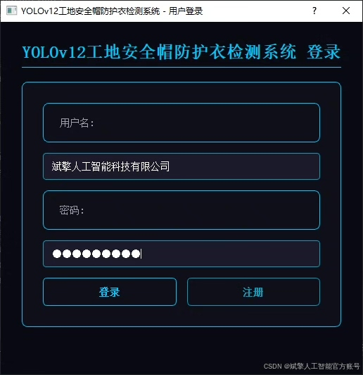
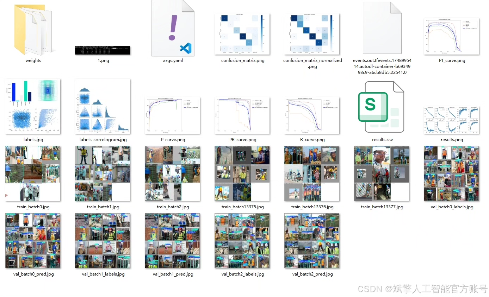
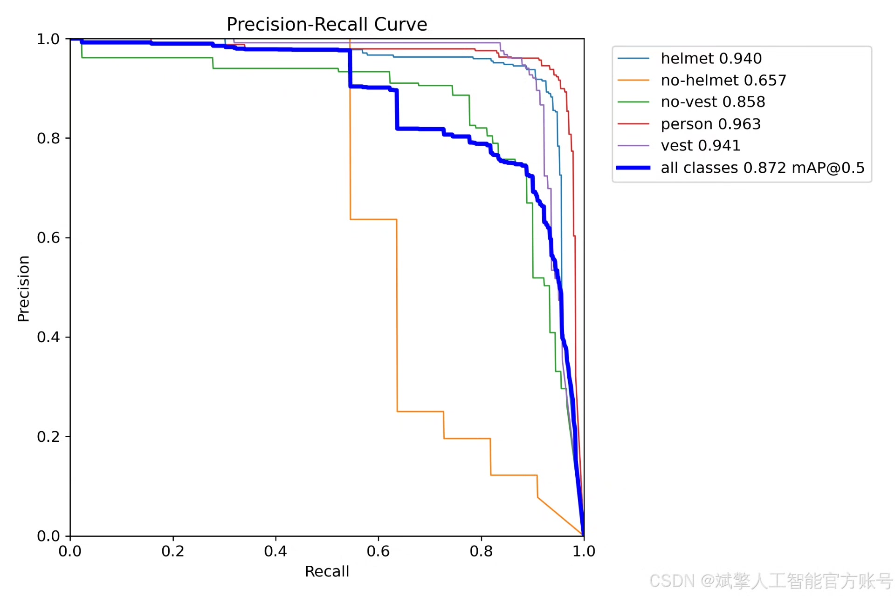
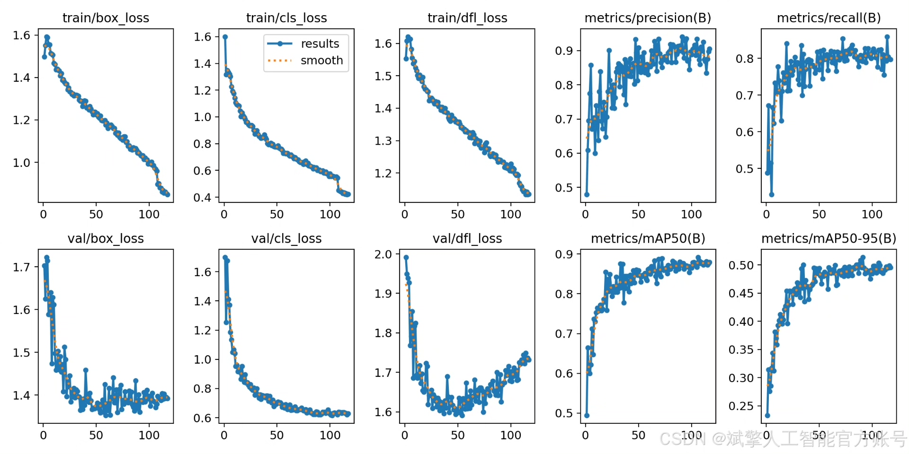
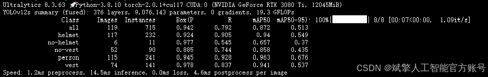

# YOLOv12 Safety Helmet and Protective Clothing Identification System

## Body

The YOLOv12 Safety Helmet and Protective Clothing Recognition System is a deep learning-based system for identifying safety helmets and protective clothing in construction sites, aiming to enhance the efficiency of safety supervision. The system employs an improved YOLOv12 algorithm, trained on a custom dataset containing five categories of targets ('helmet', 'no-helmet', 'no-vest', 'person', 'vest') with a dataset size of 997 training images, 119 validation images, and 90 test images. The system integrates a user-friendly UI interface that supports login and registration functions. Experimental results show that this system has high detection accuracy and robustness under complex construction site scenarios, providing an effective solution for intelligent safety management.
✅ User Login & Registration: Supports password verification and security validation.
✅ Three Detection Modes: Based on the YOLOv12 model, supporting image, video, and real-time camera detection, accurately recognizing targets.
✅ Dual-Screen Comparison: Displays the original scene and detection results on the same screen.
✅ Data Visualization: Real-time table displaying the category, confidence, and coordinates of detected targets.
✅ Intelligent Parameter Tuning: Offers a confidence slide bar to dynamically optimize detection accuracy, adapting to different scene requirements.
✅ Sci-Fi Interactive Interface: Dark theme paired with dynamic light effects to reduce visual fatigue and improve operational experience.

## Images

## Payment

Here is a pay link on Stripe ( https://buy.stripe.com/3cs8yP7sY87d0vu9AB ). Please contact me lonlonago@foxmail.com after funding $89, and I will send you a complete data files , thank you!

